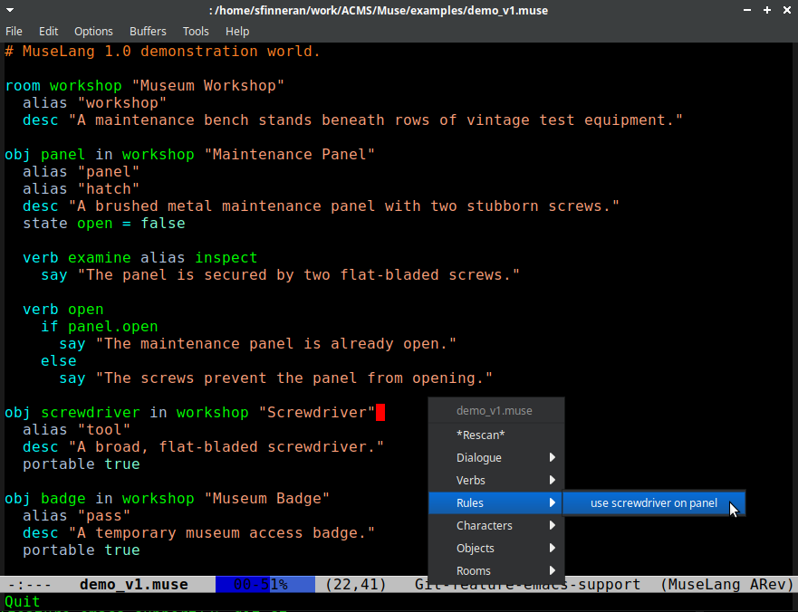

# MuseLang Mode for Emacs

`muselang-mode` is a major mode for editing MuseLang source files in GNU
Emacs.



## Features

-   Syntax highlighting for MuseLang keywords and language constructs
-   Automatic recognition of `.muse` and `.muselang` files
-   `#` comment support
-   Automatic pairing of quotes and brackets using `electric-pair-mode`
-   Basic indentation support
-   Imenu support for navigating rooms, objects, characters, verbs and
    dialogue nodes
-   Skeleton insertion commands for common language constructs
-   Optional Flymake integration using the `muselang lint` command

## Installation

Copy `muselang-mode.el` somewhere on your Emacs `load-path`.

Add the following to your Emacs configuration:

``` elisp
(require 'muselang-mode)
```

If automatic file association is not already included in the mode, add:

``` elisp
(add-to-list 'auto-mode-alist '("\\.muse\\'" . muselang-mode))
(add-to-list 'auto-mode-alist '("\\.muselang\\'" . muselang-mode))
```

Restart Emacs or evaluate the configuration.

## Usage

Opening a `.muse` or `.muselang` file will automatically enable
`muselang-mode`.

To enable it manually:

``` text
M-x muselang-mode
```

## Key Bindings

|Key        |Action                       |
|-----------|-----------------------------|
|`C-c C-r`  |Insert Room template         |
|`C-c C-o`  |Insert Object template       |
|`C-c C-c`  |Insert Character template    |
|`C-c C-e`  |Insert Exit template         |
|`C-c C-d`  |Insert Description template  |
|`C-c C-s`  |Insert Say block             |
|`C-c C-h`  |Insert Hint block            |
|`C-c C-v`  |Insert Verb template         |

## Flymake Support

If the MuseLang command line tools are installed, the mode can use:

``` text
muselang lint
```

to provide live diagnostics through Flymake.

## Imenu Support

The following top level constructs appear in the Imenu index:

-   Rooms
-   Objects
-   Characters
-   Verbs
-   Dialogue nodes
-   Rules

This allows quick navigation using `M-x imenu` or packages such as
Consult and which-key aware completion frameworks.

## Requirements

-   GNU Emacs 28 or later recommended
-   MuseLang command line tools (optional, for linting)
